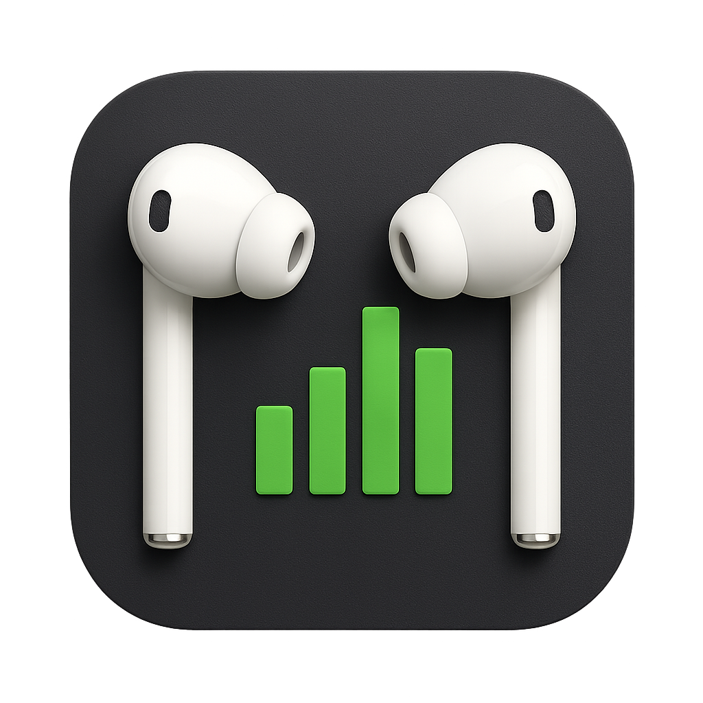

<p align="center">
  
</p>

<h1 align="center">RustPods</h1>

<p align="center">
  A simple, elegant battery monitor for Apple AirPods on Windows
</p>

<p align="center">
  <a href="https://github.com/Jay1/RustPods/actions/workflows/rust-ci.yml">
    
  </a>
  <a href="https://opensource.org/licenses/MIT">
    
  </a>
  
  
  <a href="https://codecov.io/gh/Jay1/RustPods">
    
  </a>
  <a href="https://coderabbit.ai">
    
  </a>
</p>

---

Hi guys 👋 This little project came about because I wanted a simple, no-fuss way to check my AirPods battery on Windows. I found that many existing tools were either a bit complicated to set up, weren't free, or just didn't quite fit what I needed.

So, I built this: an open-source application crafted with Rust 🦀, designed to monitor Apple AirPods (and hopefully other Bluetooth headphones too!) easily and reliably.

## ✨ Features

- 🔋 **Real-time battery monitoring** for AirPods and case
- 🖥️ **Sleek UI** with Catppuccin Mocha theme (❤️)
- 🔍 **Automatic device detection** with Bluetooth LE
- 🔔 **System tray integration** for quick access
- ⚙️ **Customizable settings** for your preferences
- 🚀 **Lightweight and efficient** built with Rust

## 📥 Installation

> **Note:** Official releases are coming soon! The repository is currently in active development.

1. Download the latest release from the [Releases](https://github.com/Jay1/RustPods/releases) page (coming soon)
2. Extract the ZIP file to any location
3. Run `RustPods.exe` - no installation required!

*For detailed instructions, see our [Getting Started Guide](docs/user-guide/getting-started.md).*

## 🚀 Quick Start

1. Launch RustPods - it will appear in your system tray
2. Make sure your AirPods are paired with Windows
3. Open the AirPods case or take them out to make them discoverable
4. RustPods will automatically scan and show battery levels

## 🖥️ Command-Line Interface

RustPods can be run in different modes through the command line:

```
Usage:
  rustpods adapters    - Discover Bluetooth adapters
  rustpods scan        - Run a basic Bluetooth scan
  rustpods interval    - Run interval-based scanning
  rustpods airpods     - Run AirPods filtering demo
  rustpods events      - Run event system demo (use cargo run --example event_system)
  rustpods ui          - Launch the UI application with original state management
  rustpods stateui     - Launch the UI application with new state management (default)
  rustpods help        - Show this help message
```

When run without any arguments, RustPods defaults to `stateui` mode, launching the main application with the new state management system.

### Examples:

```sh
# Launch the main UI application (default)
rustpods

# Show all available Bluetooth adapters on your system
rustpods adapters

# Run a scan for AirPods devices
rustpods airpods

# Show command-line help
rustpods help
```

## 📖 Documentation

Visit our [documentation](docs/index.md) for detailed guides:

- [User Guide](docs/user-guide/getting-started.md)
- [Development Guide](docs/development/assets.md)
- [Technical Documentation](docs/development/assets.md)

## 🔧 Building from Source

```sh
# Clone the repository
git clone https://github.com/Jay1/RustPods.git
cd RustPods

# Build the project
cargo build --release

# Run the application
cargo run --release
```

## 🤝 Contributing

Contributions are welcome! Check out our [CONTRIBUTING.md](CONTRIBUTING.md) guide to get started.

## 🛠️ Development Status

The project currently implements:
- Bluetooth device scanning and discovery
- AirPods device detection and identification
- User interface with dark theme
- System tray integration
- Configuration persistence

Active development continues with a focus on reliability and adding support for more headphone models.

## 📄 License

[](https://opensource.org/licenses/MIT)

This project is licensed under the MIT License - see the [LICENSE](LICENSE) file for details. 